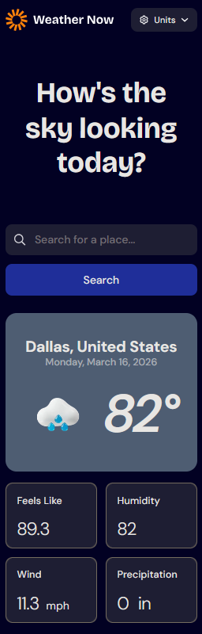

# Weather App 🌤️

A responsive weather application that displays current conditions, daily forecasts, and hourly forecasts for any location worldwide.



## Features

- Search for any city in the world
- Current weather conditions including temperature, humidity, wind speed, and precipitation
- 7-day daily forecast
- Hourly forecast with day selection
- Toggle between Imperial and Metric units

## Built With

- React
- Vite
- Tailwind CSS
- [Open-Meteo Weather API](https://open-meteo.com/)
- [Open-Meteo Geocoding API](https://open-meteo.com/en/docs/geocoding-api)

## Getting Started

### Prerequisites

Make sure you have [Node.js](https://nodejs.org/) installed on your machine.

### Installation

1. Clone the repository

```bash
   git clone https://github.com/christencodes/Weather-App-.git
```

2. Navigate to the project directory

```bash
   cd Weather-App-
```

3. Install dependencies

```bash
   npm install
```

4. Start the development server

```bash
   npm run dev
```

5. Open your browser and go to `http://localhost:5173`

## Live Demo

[View Live Site](https://christencodes.github.io/Weather-App-/)
